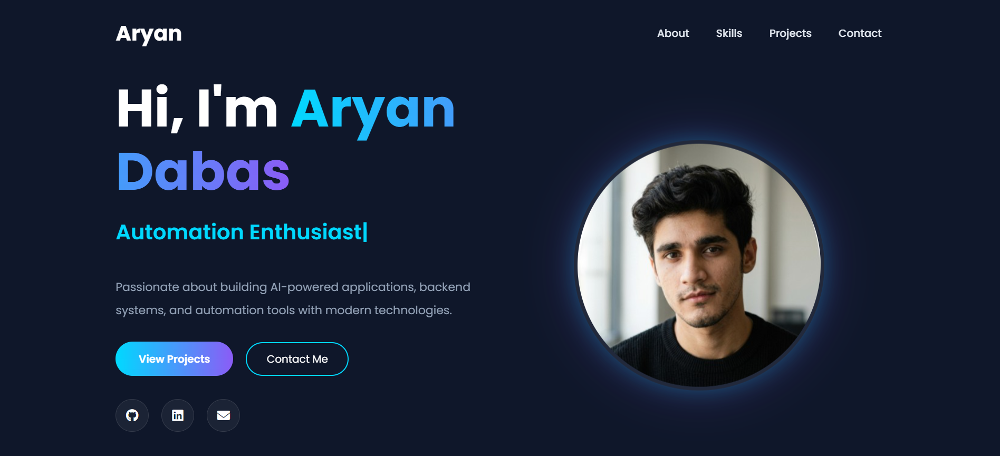

# 🚀 Aryan Dabas - Developer Portfolio

A modern and responsive AI & Backend Developer portfolio website built using HTML, SCSS, JavaScript, Bootstrap, and Parcel Bundler.

## 🌐 Live Demo

🔗 https://my-portfolio-aryandabas17s-projects.vercel.app

---

## ✨ Features

- Modern Dark UI Design
- Fully Responsive Layout
- Smooth Animations
- Typing Text Animation
- Interactive Skills Section
- Project Showcase Section
- Resume Download
- Contact Section
- SCSS Architecture
- Optimized Parcel Build

---

## 🛠️ Tech Stack

### Frontend
- HTML5
- SCSS
- JavaScript (ES6)
- Bootstrap 4

### Libraries
- ScrollReveal.js
- Typed.js

### Build Tools
- Parcel Bundler

### Deployment
- Vercel

---

## 📂 Project Structure

```bash
src/
│
├── assets/
├── css/
├── js/
└── index.html
```

---

## 📸 Portfolio Preview



---

## 🚀 Installation & Setup

Clone repository:

```bash
git clone https://github.com/aryandabas17/my-portfolio.git
```

Install dependencies:

```bash
npm install
```

Run development server:

```bash
npm start
```

Build for production:

```bash
npm run build
```

---

## 👨‍💻 Author

### Aryan Dabas

- GitHub: https://github.com/aryandabas17
- LinkedIn: https://www.linkedin.com/in/aryan-dabas-559827219/

---

## 📄 License

This project is licensed under the MIT License.
